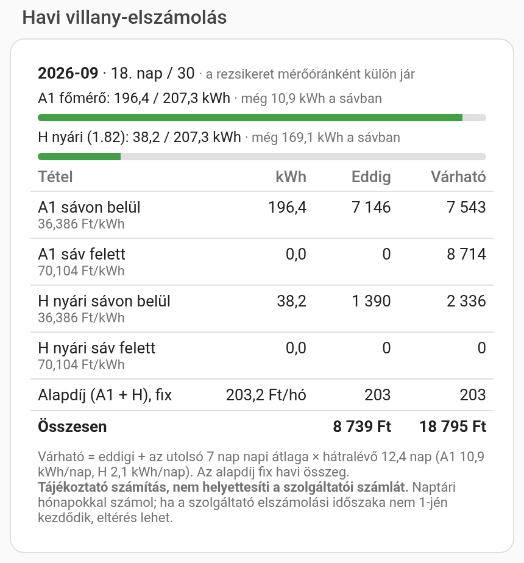
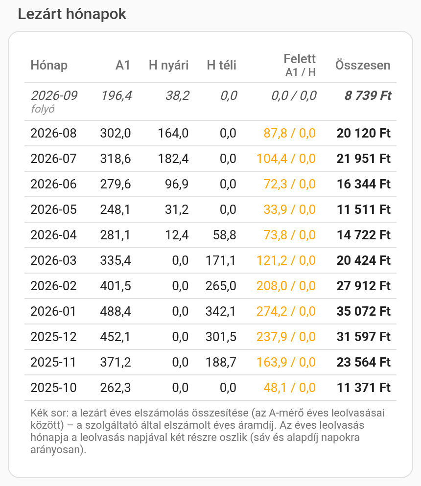
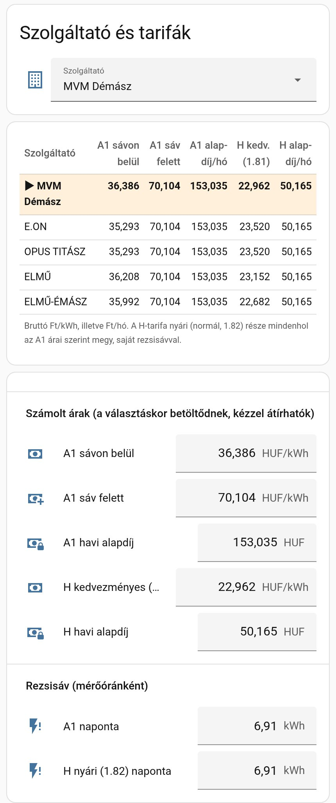
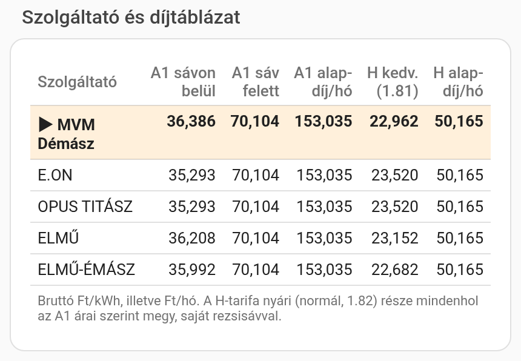
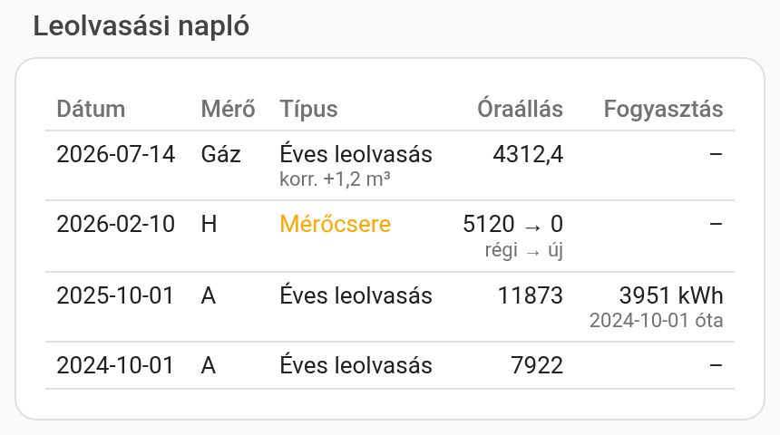

# Rezsikövető – magyar lakossági rezsi-elszámolás Home Assistanthoz

> [!IMPORTANT]
> **Tájékoztató jellegű számítás, nem helyettesíti a szolgáltatói számlát.**

Ez a tároló két dolgot tartalmaz:

1. **Rezsikövető integráció (2.0 béta, új)** – saját Home Assistant-integráció villanyra, gázra, vízre és fix díjas szolgáltatásra (pl. hulladékszállítás), „Rezsi” oldalsáv-panellel. Lásd alább és a [`docs/INTEGRACIO.md`](docs/INTEGRACIO.md) leírást.
2. **v1 YAML-csomag** – a korábbi, csomagként telepíthető villany- és gáz-elszámolás (lejjebb, változatlanul). Hibajavítást kap; utódja az integráció.

## Rezsikövető integráció (2.0 béta)

- **Fiókok felületről** (Beállítások → Eszközök és szolgáltatások → Rezsikövető): villany (A1, H-tarifa), gáz, víz (fő- és locsolási almérővel), fix díjas szolgáltatás.
- **Számlára pontos számítás:** nettó tételsoros számlázás ÁFÁ-val, egész kWh-s kedvezményes keret, számlánkénti alapdíj, gáz MJ-ban havi fűtőértékkel. Valódi MVM- és DAKÖV-számlákon forintra ellenőrizve.
- **Automatikus számlafeldolgozás** egy mappából (pl. a Díjnet-integráció letöltései): befizetések, valódi mérőállások, havi fűtőértékek.
- **„Mennyibe került? → Mennyi lesz? → Hol tartok a keretben? → Kell-e változtatnom?”**: eddigi és várható költség, kedvezményes keret, **várható elszámolás** („ha ma lenne az elszámolás”), részszámlás (átalány) fióknál éves egyenleg, elmaradt számla figyelmeztetés.
- **„Rezsi” oldalsáv-panel** a HA-ban: összesítő, figyelmeztetések, fiókonkénti kártyák, részletek (lezárt időszakok, mérőállások, számlák), mérőállás rögzítése.
- **Napelem (kísérleti):** bruttó és szaldó elszámolás – valódi napelemes számlákkal még ellenőrizendő (`docs/terv/05_NAPELEM.md`).

### Telepítés (HACS, béta)

1. HACS → ⋮ → **Egyéni tárolók** → `https://github.com/Gyuszko55/ha-energia-elszamolas-hu`, típus: **Integráció**.
2. A Rezsikövetőnél kapcsold be a **béta verziók megjelenítését**, és töltsd le a legújabbat.
3. Indítsd újra a Home Assistantot, majd: Beállítások → Eszközök és szolgáltatások → Integráció hozzáadása → **Rezsikövető**.
4. Részletek, átállás a v1 csomagról: [`docs/INTEGRACIO.md`](docs/INTEGRACIO.md). Tervek: [`docs/terv/`](docs/terv/).

---

# v1 YAML-csomag: villany- és gáz-elszámolás (magyar lakossági tarifák)

> [!IMPORTANT]
> **Tájékoztató jellegű számítás, nem helyettesíti a szolgáltatói számlát.**
> A csomag a saját mérőid adataiból és a beírt árakból becsül. A fizetendő összeg mindig a szolgáltató számláján szerepel.
> **Eltérések lehetnek.** A csomag naptári hónapokkal (1-jétől a hónap végéig) számol. Ha a szolgáltató leolvasási, elszámolási időszaka nem a hónap első napjával kezdődik, a sávok, a havi összegek és az éves összesítő is eltérhetnek a számlától. Eltérést okozhat még a saját mérő pontatlansága, a kerekítés, az árváltozás időpontja, és a számlán szereplő egyéb tételek (pl. díjak, kedvezmények, ÁFA-bontás).

Home Assistant csomag, amely a magyar lakossági áramszámlát **napra készen** kiszámolja:

- **Havi elszámolás mérőóránkénti rezsisávval**: napi 6,91 kWh × a hónap napjai, külön a főmérőre (A1) és a H-tarifás mérő nyári részére.
- **Szolgáltató-választó díjtáblázattal:** MVM Démász, E.ON, OPUS TITÁSZ, ELMŰ, ELMŰ-ÉMÁSZ. Váltáskor az árak maguktól betöltődnek.
- **H-tarifa téli/nyári bontás:** a téli (1.81) rész kedvezményes áron, a nyári (1.82) rész A1 áron, a saját sávjával.
- **„Eddig” és „Várható” összeg:** a várható összeg az utolsó 7 nap átlagából becsül a hónap végére.
- **Automatikus hónapzárás** minden hónap 1-jén: napló és CSV-fájl, alatta a **Lezárt hónapok** táblázat, benne az **éves elszámolás összesítővel**.
- **Mérőóra-leolvasás és mérőcsere** a felületről (villany A, villany H, gáz). A HA a valódi órát mutatja, és a csere nem torzítja a fogyasztást.
- **Tizedesvessző a beviteli mezőkben** (saját `hu-szam-sor` sorelem).

| Folyó hónap | Lezárt hónapok |
|---|---|
|  |  |

| Szolgáltató és tarifák | Díjtáblázat | Leolvasási napló |
|---|---|---|
|  |  |  |

*A képeken mintaadatok vannak.*

---

## Telepítés feltételei – mit kell előre telepíteni

| # | Mit | Honnan / hogyan | Kötelező? |
|---|---|---|---|
| 1 | **Home Assistant 2025.10 vagy újabb** | Beállítások → Rendszer → Frissítések | igen |
| 2 | **Energiamérő a főmérő áramkörén**, amely folyamatosan növekvő kWh-értéket ad (`total_increasing`): pl. Shelly EM / Pro EM, P1-es okosmérő-olvasó, Zigbee mérő | a mérő integrációja | igen |
| 3 | **Energiamérő a H-tarifás körön** (hőszivattyú, klíma) | a mérő integrációja | csak ha van H-tarifád |
| 4 | **Gázfogyasztás-szenzor** (m³, soha nem nullázódó): gázóra-impulzusolvasó, vagy a [ha-futes-hu](https://github.com/Gyuszko55/ha-futes-hu) gázbecslése (`sensor.kazan_gaz_osszesen`) | a szenzor integrációja / ha-futes-hu | csak a gáz részhez |
| 5 | **[HACS](https://hacs.xyz/)** | https://hacs.xyz/docs/use/ | igen (a 6. ponthoz) |
| 6 | **html-template-card** | HACS → Frontend → „Lovelace HTML Jinja2 Template card” → Letöltés | igen (a táblázatokhoz) |
| 7 | **Csomagok bekapcsolása** a `configuration.yaml`-ban (`packages: !include_dir_named packages`) | lásd lent, 2. lépés | igen |
| 8 | **Terminal & SSH** vagy **File editor** / **Samba** add-on a fájlok másolásához | Beállítások → Bővítmények → Bővítménybolt | az egyik kell |

## Telepítés

### 1. Fájlok másolása

Töltsd le a [legfrissebb kiadás](../../releases/latest) zip-fájlját, és a benne lévő `config/` mappa **tartalmát** másold a Home Assistant `config` mappájába (Samba, File editor vagy Studio Code Server). A szerkezet:

```
config/
├── packages/energia_elszamolas/     ← 4 YAML-csomag
├── custom_templates/villany_elszamolas.jinja
├── energia_elszamolas/              ← CSV-író szkriptek (havi.sh, naplo.sh)
└── www/hu-szam-sor/hu-szam-sor.js
```

Terminálból (Terminal & SSH add-on) egy lépésben:

```sh
cd /config && curl -sL https://github.com/Gyuszko55/ha-energia-elszamolas-hu/archive/refs/heads/main.tar.gz \
  | tar xz --strip-components=1 --wildcards '*/packages/*' '*/custom_templates/*' '*/energia_elszamolas/*' '*/www/*'
```

### 2. A csomagok bekapcsolása

A `configuration.yaml`-ban legyen benne (ha már van `packages:` sorod, az is jó):

```yaml
homeassistant:
  packages: !include_dir_named packages
```

### 3. Újraindítás

Fejlesztői eszközök → YAML → **Konfiguráció ellenőrzése**, majd **Újraindítás**. Teljes újraindítás kell, mert a `custom_templates` és a statisztika-szenzorok csak így töltődnek be.

### 4. A beviteli sor regisztrálása

Beállítások → Irányítópultok → ⋮ → **Erőforrások** → Erőforrás hozzáadása:

- URL: `/local/hu-szam-sor/hu-szam-sor.js?v=2`
- Típus: **JavaScript modul**

Ha nem látod az Erőforrások menüt, a felhasználói profilodban kapcsold be a **Haladó módot**.

### 5. Az irányítópult nézet

Nyisd meg a [`dashboard/energia_elszamolas_nezet.yaml`](dashboard/energia_elszamolas_nezet.yaml) fájlt. Egy irányítópulton: ⋮ → Szerkesztés → ⋮ → **Nyers konfigurációszerkesztő**.

- **Új, üres irányítópultnál:** a teljes tartalmat cseréld le a fájlra.
- **Meglévő irányítópultnál:** a `- title: Energia-elszámolás` blokkot másold a saját `views:` listád végére.

### 6. Források megadása és első beállítás

Az új **Energia-elszámolás** nézet alján, a **Beállítás / Források** kártyán:

1. **A1 főmérő (entitás):** írd be a főmérő energia-szenzorod azonosítóját, pl. `sensor.shelly_em_total_active_energy`.
2. **A1 szorzó:** alapból 1. Ha a saját mérőd tartósan eltér a szolgáltatói órától, itt korrigálhatod. Ha például a hivatalos óra 4%-kal többet mutat, írj be 1,04-et. Az első beállítás előtt állítsd be. Ha később módosítod, az óraállás elugrik, ezt egy korrekcióval kell visszaigazítani.
3. **H-tarifa mérő** és **Gáz:** csak ha van. Üresen hagyva ezek a részek kimaradnak, és a H alapdíjat sem számolja.
4. Az **Ellenőrzés** sorokban nézd meg, hogy az „A1 forrás” mutat-e számot.
5. Válaszd ki a **szolgáltatódat** a „Szolgáltató és tarifák” kártyán.
6. Nyomd meg az **Első beállítás → Indítás** gombot. Ez a mostani óraállásokkal indítja a folyó hónapot, a H-tarifa bontást és az árakat. Addig az óraállások „nem elérhetők”, mert az új számmezők a minimumukon indulnak, és a szkript nullázza ki őket. A gomb újra megnyomható, a már beállított értékekhez nem nyúl.
7. A **Mérőóra leolvasás** kártyán rögzítsd a legutóbbi **éves leolvasást** és a mostani óraállást. Ha a HA mást mutat, írd be az eltérést korrekcióként. Ettől kezdve az éves fogyasztás és az éves összesítő is számol.

> Az első hónap részleges: a telepítés napjától számol. A régebbi hónapokat a csomag nem tölti vissza magától.

---

## Hogyan számol

| Tétel | Szabály |
|---|---|
| **A1 sávon belül** | a főmérő havi fogyasztása 6,91 kWh × a hónap napjai mennyiségig, rezsicsökkentett áron |
| **A1 sáv felett** | a fölötte lévő rész, piaci áron |
| **H téli (1.81)** | okt. 15. – ápr. 15., kedvezményes áron, sáv nélkül |
| **H nyári (1.82)** | ápr. 15. – okt. 15., A1 áron, de **saját, külön** 6,91 kWh/nap sávval |
| **Alapdíj** | A1 + H havi alapdíj, fix összeg (fogyasztás nélkül is jár) |
| **Várható** | eddigi + az utolsó 7 nap napi átlaga × a hátralévő napok, mérőnként |
| **Megosztott hónap** | ha a hónap közepén éves leolvasás volt, a hónap két részre oszlik. A sáv és az alapdíj napokra arányosan oszlik meg, és a lezárt évhez kék **Éves elszámolás** sor kerül. |

A számítás a `custom_templates/villany_elszamolas.jinja` fájlban van, az eredmény a `sensor.villany_havi_elszamolas` szenzor `adatok` attribútumában.

## Árak és szolgáltatók

A díjtáblázat a 2026. szeptemberi bruttó lakossági árakat tartalmazza (Ft/kWh, illetve Ft/hó):

| Szolgáltató | A1 sávon belül | A1 sáv felett | A1 alapdíj/hó | H kedv. (1.81) | H alapdíj/hó |
|---|---:|---:|---:|---:|---:|
| MVM Démász | 36,386 | 70,104 | 153,035 | 22,962 | 50,165 |
| E.ON | 35,293 | 70,104 | 153,035 | 23,520 | 50,165 |
| OPUS TITÁSZ | 35,293 | 70,104 | 153,035 | 23,520 | 50,165 |
| ELMŰ | 36,208 | 70,104 | 153,035 | 23,152 | 50,165 |
| ELMŰ-ÉMÁSZ | 35,992 | 70,104 | 153,035 | 22,682 | 50,165 |

**Mindig ellenőrizd a saját számládon.** A „Számolt árak” mezők kézzel is átírhatók. Egy szolgáltató árait a `hu_energia_elszamolas.yaml` fájl `Villany díjtáblázat` szenzorában módosíthatod. Új szolgáltatónál a nevét az `input_select.villany_szolgaltato` listájába is fel kell venni.

**HA Energia irányítópult (opcionális):** a `sensor.villany_aktualis_ar`, a `sensor.h_tarifa_aktualis_ar` és a `sensor.gaz_aktualis_ar` megadható a forrásokhoz „ár-entitásként”. Ezek a sávtól függően váltanak.

## Mentések

- **Havi napló:** `sensor.villany_havi_elszamolas_naplo` és `config/energia_elszamolas/havi.csv`.
- **Leolvasási napló:** `sensor.meroora_leolvasasi_naplo` és `config/energia_elszamolas/naplo.csv`.

Egy hibás bejegyzés törlése: Fejlesztői eszközök → Események.

- **Hónap:** esemény `villany_havi_elszamolas_torles`, adat: `honap: "2026-09"`.
- **Leolvasás:** esemény `meroora_leolvasas_torles`, adat: `rogzitve: "<a bejegyzés rogzitve mezője>"`.

## Részletes használati útmutató

[docs/HASZNALAT.md](docs/HASZNALAT.md): a kártyák elemei, gyakori teendők (éves leolvasás, mérőcsere, árváltozás) és hibaelhárítás.

## Frissítés, eltávolítás

- **Frissítés:** másold felül a fájlokat, és indítsd újra a HA-t. A beállított értékek (árak, óraállások, naplók) megmaradnak.
- **Eltávolítás:** töröld a `packages/energia_elszamolas`, a `custom_templates/villany_elszamolas.jinja`, az `energia_elszamolas` és a `www/hu-szam-sor` mappát/fájlt, az erőforrást és a nézetet, majd indítsd újra a HA-t.

## Készítők

- **Gyuszko55** – ötlet, tervezés, a v1 csomag és a Rezsikövető integráció
- **Krissz55555** (Krisztián) – társszerző, a Rezsikövető integráció közreműködője

## Licenc

MIT. Használd, alakítsd át szabadon, garancia nélkül. A számítás tájékoztató jellegű, nem helyettesíti a szolgáltatói számlát (lásd a figyelmeztetést a lap tetején).
