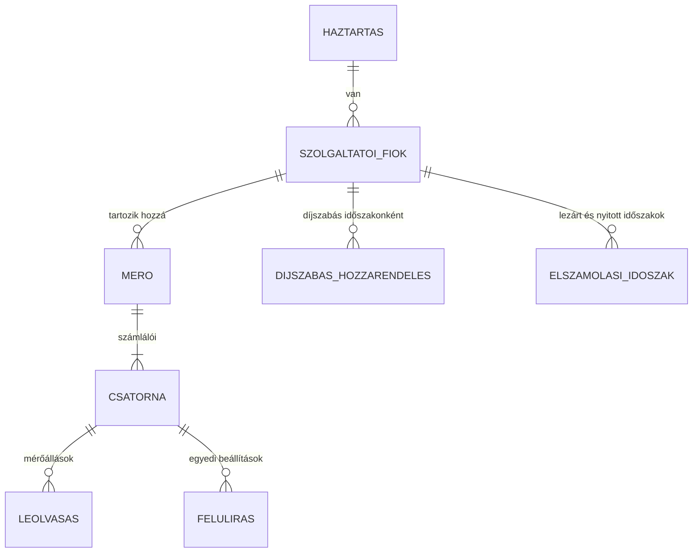

# 01 – Adatmodell

## Szerkezet

```
Háztartás
└── Szolgáltatói fiók   (közmű + szolgáltató + díjszabás-hozzárendelés)
    └── Mérő            (fizikai óra, gyári számmal; cserekor új mérő)
        └── Csatorna    (egy számláló: vételezés, betáplálás, téli/nyári regiszter…)
            └── Leolvasások (dátumozott mérőállások)
```



## Entitások

### Háztartás

| Mező | Típus | Leírás |
|---|---|---|
| `id` | szöveg | Belső azonosító |
| `nev` | szöveg | Pl. „Hernád” |
| `penznem` | szöveg | `HUF` (rögzített) |

### Szolgáltatói fiók

Egy szerződés egy közművel. Egy háztartásban lehet pl. két villanyfiók (A1 és H külön szerződéssel), egy gáz és egy víz.

| Mező | Típus | Leírás |
|---|---|---|
| `kozmu` | `villany` \| `gaz` \| `viz` | Melyik modul kezeli |
| `szolgaltato` | szöveg | A díjfájlok szolgáltató-kulcsa (pl. `mvm_demasz`), vagy `egyedi` |
| `idoszak_mod` | `naptari_honap` \| `leolvasas_alapu` \| `egyedi_nap` | Hogyan vágjuk időszakokra (lásd 03) |
| `idoszak_nap` | egész | `egyedi_nap` esetén a hónap hányadik napján indul az időszak |
| `ugyfelazonosito` | szöveg, opcionális | Csak megjelenítésre |
| `fizetesi_mod` | `fogyasztas_szerint` \| `reszszamla` | Lásd lent: részszámlás (átalány) elszámolás |

### Részszámla (átalányfizetés)

Sok háztartásban – főleg gáznál – nem a havi tényleges fogyasztást fizetjük: a szolgáltató az előző év
fogyasztása alapján havi **részszámlát** állít ki (azonos vagy szezonálisan súlyozott összeggel), és az
**éves elszámoló számla** a tényleges fogyasztás alapján **ráfizetést vagy visszatérítést** hoz.

| Mező | Típus | Leírás |
|---|---|---|
| `datum` | dátum | A részszámla kelte vagy esedékessége |
| `osszeg` | Ft | A részszámla bruttó összege |
| `mennyiseg` | szám, opcionális | A részszámlán szereplő (gyakran becsült) mennyiség |
| `forras` | `kezi` \| `terv` \| `entitas` | Kézzel rögzítve, éves részszámla-tervből, vagy HA-entitásból (pl. Díjnet-integráció) |

Részszámlás fióknál a motor két dolgot számol párhuzamosan: a **tényleges költséget** a mért fogyasztásból
(ahogy eddig), és a **befizetéseket** a részszámlákból. A kettő különbsége a várható éves egyenleg.

### Díjszabás-hozzárendelés

Melyik díjszabás érvényes a fiókra, mettől. Tarifaváltáskor (pl. A1 → A2) új sor jön létre, a régi nem változik.

| Mező | Típus | Leírás |
|---|---|---|
| `dijszabas` | szöveg | Díjfájl-kulcs, pl. `villany/a1` |
| `ervenyes_tol` | dátum | Ettől a naptól érvényes |
| `ervenyes_ig` | dátum, opcionális | Üres = máig |

### Mérő

| Mező | Típus | Leírás |
|---|---|---|
| `gyari_szam` | szöveg | A mérő azonosítója |
| `beepitve` | dátum | Mérőcserénél a csere napja |
| `kiszerelve` | dátum, opcionális | Üres = működik |
| `kezdo_allasok` | csatornánként | Beépítéskori állás |
| `zaro_allasok` | csatornánként | Kiszereléskori állás |

**A mérőcsere tehát nem korrekció, hanem egy mérő lezárása és egy új nyitása.** A fogyasztás mérőnként
számolódik (záró − kezdő), és a fiók szintjén adódik össze. Így nincs szükség a v1 „mérőcserék összesen” mezőjére.

### Csatorna

| Mező | Típus | Leírás |
|---|---|---|
| `szerep` | lásd lent | Mit mér a számláló |
| `mertekegyseg` | `kWh` \| `m3` | A mérő saját egysége |
| `forras_entitas` | entitás-azonosító, opcionális | Automatikus HA-szenzor (pl. Shelly, P1-olvasó, vízóra-impulzus) |
| `forras_szorzo` | szám, alapértelmezés 1 | Ha a HA-szenzor és az óra rendszeresen eltér (pl. 1,0412) |
| `keret_aktiv` | igen/nem | Jár-e kedvezményes keret erre a csatornára |
| `csatornadij_aktiv` | igen/nem | Csak víznél; locsolási almérőnél kikapcsolva |

**Csatorna-szerepek:**

| Közmű | Szerep | Példa |
|---|---|---|
| villany | `vetelezes` | Normál mérő, napelem nélkül ez az egyetlen |
| villany | `betaplalas` | Napelemes rendszer visszatáplálása |
| villany | `zona_csucs`, `zona_volgy` | Kétzónás (A2) mérő |
| villany | `vezerelt` | B-tarifa (vezérelt) |
| villany | `h_teli`, `h_nyari` | H-tarifa, ha a mérő külön regiszterben számol |
| gáz | `vetelezes` | m³-ben mérve, MJ-ra átváltva |
| víz | `vetelezes` | Fővízmérő vagy almérő |

> **H-tarifa megjegyzés:** a legtöbb H-mérő egyetlen számlálóval mér. Ilyenkor egy `vetelezes` csatorna van,
> és a téli/nyári felosztást az elszámoló motor végzi a dátum alapján (lásd 03). Ez a v1 bevált `h_tarifa_szakasz` logikája.

### Leolvasás

| Mező | Típus | Leírás |
|---|---|---|
| `datum` | dátum (és opcionálisan idő) | |
| `allas` | szám | Mérőállás a csatorna egységében |
| `tipus` | `kezi` \| `szolgaltatoi` \| `automatikus` \| `korrekcio` | |
| `elszamolasi` | igen/nem | Szolgáltatói elszámoló leolvasás-e. Ha igen, időszakhatár lehet. |
| `megjegyzes` | szöveg | |

**Elsőbbség:** ugyanarra a napra a `szolgaltatoi` > `kezi` > `automatikus`. Az automatikus értékeket nem
tároljuk naponta, mert a HA statisztikájából visszakereshetők. Csak a nap végi állást mentjük, ha szükséges.

### Felülírás

Bármely díj vagy szabály-paraméter csatornánként vagy fiókonként, dátumtól felülírható.

| Mező | Típus | Leírás |
|---|---|---|
| `kulcs` | szöveg | A díjfájl egy mezője, pl. `dijak.energia_kedvezmenyes` |
| `ertek` | szám | |
| `ervenyes_tol` | dátum | |

Rétegek, alulról felfelé: **díjfájl (hivatalos) → fiók-felülírás → csatorna-felülírás**.

### Elszámolási időszak

| Mező | Típus | Leírás |
|---|---|---|
| `tol`, `ig` | dátum | `ig` kizárólagos |
| `allapot` | `nyitott` \| `lezart` | |
| `eredmeny` | struktúra | A motor kimenete (lásd 03), lezáráskor befagyasztva |

**A lezárt időszak eredménye nem számolódik újra**, még akkor sem, ha később módosul egy díj.
Újraszámolás csak kifejezett felhasználói kérésre történik.

## Példa: a mostani éles háztartás

```yaml
haztartas: Hernád
fiokok:
  - kozmu: villany
    szolgaltato: mvm_demasz
    dijszabas: [{dijszabas: villany/a1, ervenyes_tol: 2024-01-01}]
    idoszak_mod: naptari_honap
    merok:
      - gyari_szam: "A-…"
        csatornak:
          - szerep: vetelezes
            forras_entitas: sensor.meroora_allas
            forras_szorzo: 1.0412
            keret_aktiv: true
  - kozmu: villany
    szolgaltato: mvm_demasz
    dijszabas: [{dijszabas: villany/h, ervenyes_tol: 2024-01-01}]
    merok:
      - gyari_szam: "H-…"
        csatornak:
          - szerep: vetelezes      # téli/nyári bontás a motorban
            keret_aktiv: true      # a nyári (A1 áras) részre külön keret jár
  - kozmu: gaz
    szolgaltato: mvm_next
    dijszabas: [{dijszabas: gaz/lakossagi, ervenyes_tol: 2024-01-01}]
    merok:
      - csatornak:
          - szerep: vetelezes
            forras_entitas: sensor.gaz_meroora_allas
            keret_aktiv: true
```

## Hol tárolódik?

- **Szerkezet (fiók, mérő, csatorna):** HA beállítási bejegyzések. Háztartásonként egy bejegyzés, a fiókok az ún. alárendelt bejegyzésekben (config subentry), így a felületen egyenként vehetők fel és szerkeszthetők.
- **Leolvasások, felülírások, lezárt időszakok:** a HA saját tárhelye (`.storage/hu_rezsi.<háztartás>`), verziózott sémával és átvezetéssel.
- **Hivatalos díjak:** az integrációval szállított díjfájlok (lásd 02).

Mentés és visszaállítás így a HA szokásos biztonsági mentésével együtt működik.
